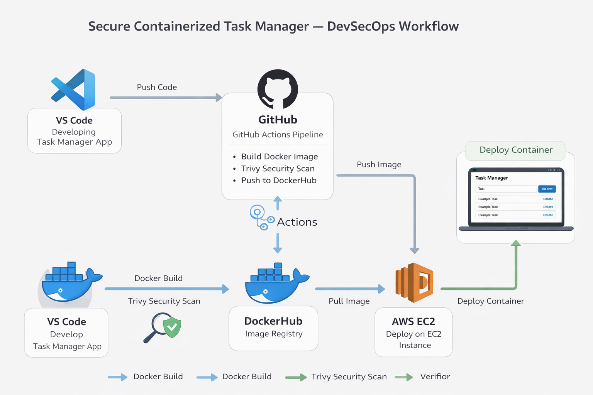
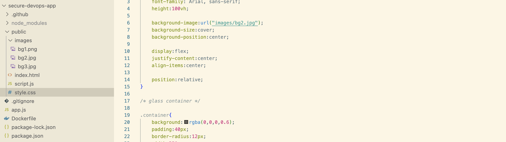
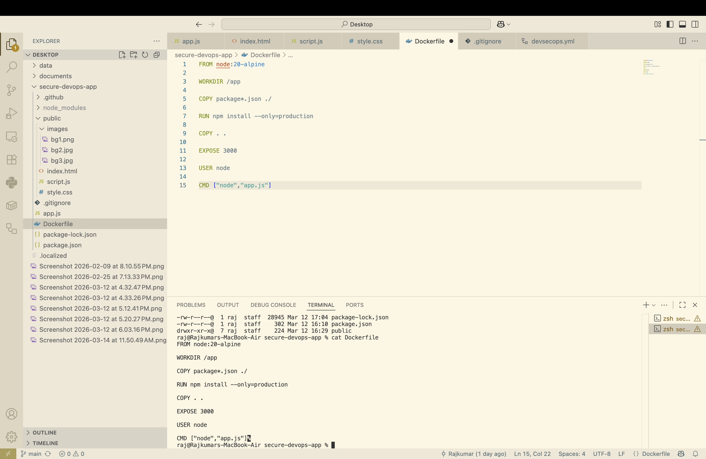
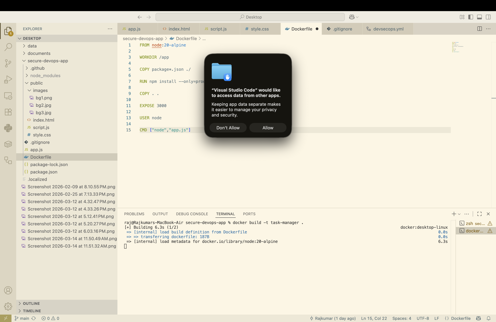
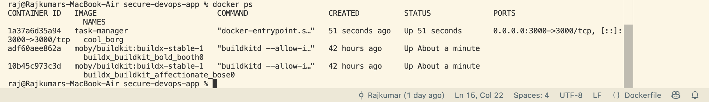
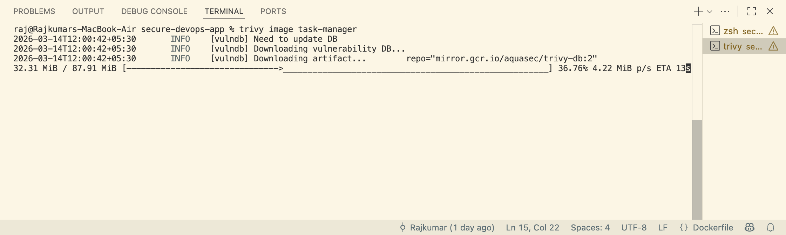
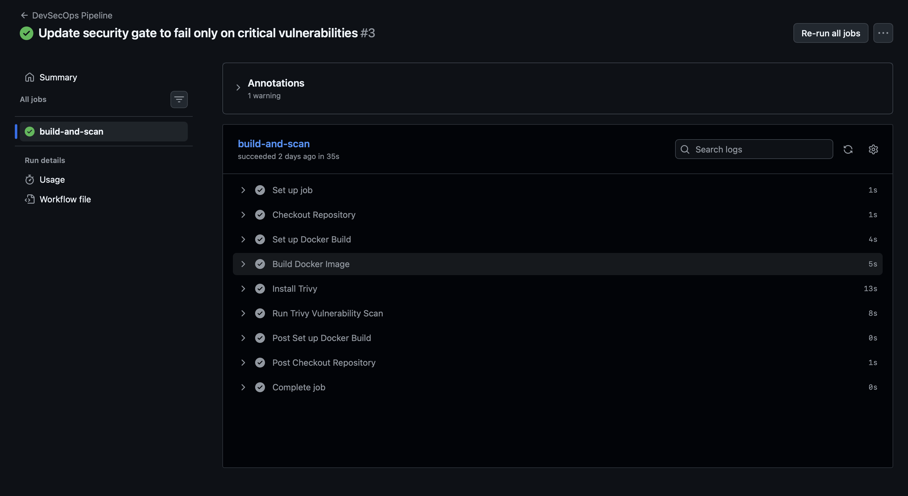
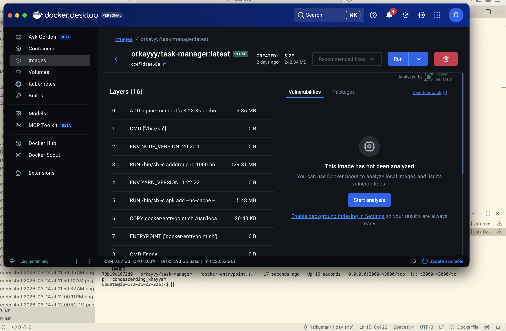

# 🚀 Secure Containerized Application Deployment with DevSecOps Pipeline

## 📌 Overview
This project demonstrates the implementation of a **secure DevSecOps pipeline** for deploying a containerized web application. A lightweight **Node.js Task Manager application** is developed, containerized using Docker, scanned for vulnerabilities, and deployed on a cloud environment.

The pipeline integrates **security checks into the CI workflow**, ensuring that vulnerabilities are identified before deployment.

---

## 🏗️ Architecture



**Workflow:**

Developer → GitHub → CI Pipeline → Security Scans → Docker Image → DockerHub → AWS EC2 → Deployment

---

## ⚙️ Tech Stack

- **Backend:** Node.js, Express  
- **Containerization:** Docker  
- **Security Scanning:** Trivy  
- **CI/CD:** GitHub Actions  
- **Container Registry:** DockerHub  
- **Cloud Platform:** AWS EC2  

---

## 🔑 Key Features

- ✅ Containerized web application using Docker  
- 🔍 Automated vulnerability scanning using Trivy  
- ⚙️ CI pipeline using GitHub Actions  
- ☁️ Cloud deployment on AWS EC2  
- 📦 DockerHub integration for image storage  
- 🔄 Reproducible and consistent deployments  

---

## 📂 Project Structure


secure-devops-app/
│── app.js
│── package.json
│── Dockerfile
│── public/
│── docs/
│ └── screenshots/
│── .github/
│ └── workflows/
│ └── devsecops.yml


---

## 🐳 Docker Setup

### Build Image

```bash
docker build -t task-manager .

Run Container
docker run -d -p 3000:3000 task-manager

Access Application

http://localhost:3000

🔐 Security Scanning (Trivy)
trivy image task-manager

Trivy scans for:

OS vulnerabilities

Dependency vulnerabilities

⚙️ CI Pipeline (GitHub Actions)

The pipeline performs:

Docker image build

Trivy vulnerability scan

Build validation

Triggered on:
git push
📦 DockerHub Integration
docker tag task-manager orkayyy/task-manager
docker push orkayyy/task-manager

☁️ Deployment on AWS EC2
Connect to EC2
ssh -i your-key.pem ubuntu@<EC2_PUBLIC_IP>

Pull Image
docker pull orkayyy/task-manager

Run Container
docker run -d -p 3000:3000 orkayyy/task-manager

Access Application

http://<EC2_PUBLIC_IP>:3000

## 📸 Screenshots

### Project Structure


### Dockerfile


### Docker Build


### Running Container


### Application (Local)


### Trivy Scan


### GitHub Actions


### DockerHub Image


### EC2 Deployment


📊 Results

Automated Docker build and deployment

Vulnerabilities detected before deployment

Reduced manual security effort

Faster deployment

🎯 Conclusion

This project demonstrates how DevSecOps practices enable secure and automated deployments using containerization, CI pipelines, and cloud infrastructure.

🚀 How to Re-run Project
Locally
docker build -t task-manager .
docker run -d -p 3000:3000 task-manager
On EC2
docker pull orkayyy/task-manager
docker run -d -p 3000:3000 orkayyy/task-manager
📬 Author

Rajkumar
M.Tech – Cloud Computing

⭐ Notes

Stop EC2 instance to avoid charges
mkdir -p docs/screenshots